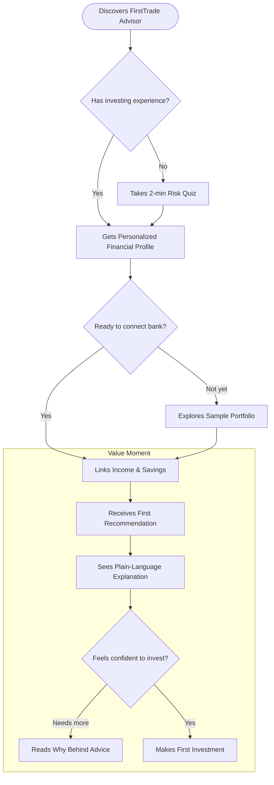

# 🤖 PM Sidekick

### The AI copilot for every kind of PM — from learning the craft to skipping the grunt work.

> **Built by a PM who got tired of context-switching between 5 tools to do one job.**

[](https://python.org)
[](https://anthropic.com)
[]()
[](LICENSE)

> © 2026 Siddhi Naik · All visual artifacts, personas, and discovery work are original. Licensed under [CC BY-NC 4.0](LICENSE) — share with attribution, not for commercial use.

---

## The Problem

Product managers spend 60–70% of their time on work that doesn't require their expertise.

Writing stories. Reformatting research. Translating Slack conversations into JIRA tickets. Creating flow diagrams from scratch. Explaining what a PRD is — again.

**Every existing AI PM tool makes this worse, not better:**
- They assume you already know agile methodology
- They're point solutions — research here, diagrams there, stories somewhere else
- They add process overhead without removing actual work
- They're built for experienced PMs — useless if you're still learning

**PM Sidekick does the full chain, in plain English, for any PM.**

---

## How It's Different from Claude Code PM Plugins

The Claude Code PM plugin ecosystem — including Anthropic's official Product Management plugin and community plugins like `pm-skills` — is genuinely powerful. 47+ skills, slash commands like `/write-spec` and `/competitive-brief`, battle-tested PM frameworks baked in.

But there's a real barrier: **you need Claude Code installed, authenticated, and a terminal open to use any of it.** That eliminates the majority of PMs — especially anyone early in their career who's never touched a terminal.

| | Claude Code PM Plugins | PM Sidekick |
|---|---|---|
| **Setup required** | Terminal install + auth + workspace config | Zero — runs in a browser |
| **PM knowledge required** | Yes — you invoke `/write-spec` knowing what a spec is | No — describe it in plain English |
| **Who can use it** | Terminal-comfortable PMs | Any PM, zero prior knowledge |
| **Research → diagram → artifact** | Separate commands, manual sequencing | Single flow, one input |
| **Teaching layer** | Methodology-first, framework-heavy | Embedded in output, ambient learning |
| **JIRA export** | Via MCP integration (setup required) | Native, no config |

**PM Sidekick's position:** zero barrier to entry + full chain in one flow. No terminal. No methodology knowledge. No tool-switching. Describe what you're building and get the complete set of artifacts in under 2 minutes.

---

## What It Does

Describe what you're building like you'd explain it to a colleague. PM Sidekick handles the rest.

```
Plain English description of your feature or product
        ↓
  Market Research Agent
  → competitive landscape, target user summary, market gaps
        ↓
  Flow Diagram Generator
  → mermaid diagram of user journey or system flow
        ↓
  Artifact Export  (Week 2)
  → JIRA epics, user stories, Notion pages, or plain CSV
```

No templates. No required fields. No methodology knowledge needed.

---

## Who It's For

| Persona | Their situation | What they need |
|---|---|---|
| 🎓 **The Learner** *(anchor)* | 1–3 yrs PM, learning on the job | Understand + do — explains as it generates |
| 🔥 **The Overloaded** | Solo PM at a startup, 47 tabs open | Zero-setup speed — paste and go |
| ⚙️ **The Pragmatist** | Senior PM, hates writing things down | High-quality output from minimal input |
| 🤖 **The AI-Curious** | Mid-level PM, needs AI credibility | Safe sandbox to experiment and share |

The Learner is the anchor. **PM Sidekick is the only tool designed to build PM skills while doing PM work** — not just automate work for people who already know what they're doing.

---

## Features — Built in Iterations

### ✅ Week 1 — Market Research Agent + Flow Diagrams
- Paste a plain-English product brief
- Get back: competitive landscape, target user summary, market gaps
- Auto-generate a mermaid user flow diagram
- No methodology required. No template. Just describe it.

### 🔜 Week 2 — Artifact Export Layer
- Structured JSON output → JIRA epics, stories, or task lists
- Choose your format: JIRA, Notion, plain text, CSV
- One click. No reformatting.

### 🔜 Week 3 — Epic & Story Writer (Format-Flexible)
- Write epics and stories in any format — agile, shape-up, or free-form
- Learning layer: explains what each artifact means and why it's structured that way
- Expert mode toggle: removes all explanations for experienced PMs

---

## Example Output

> Brief: *"finance advisor for someone new to the stock market in their 20s"*



*Generated in under 90 seconds from a one-line brief. No template. No methodology knowledge required.*

---

## Visual Artifacts

This project was built PM-first — discovery, personas, wireframes, and behavioral design before a single line of code. All artifacts below render natively on GitHub.

### Wireframes — 5 Screens


*Home · Processing · Research results · Flow diagram · Export*

---

### Product Flow Diagram


*Plain-English brief → Market research agent → Flow diagram generator → Artifact export → Story writer*

---

### User Journey Map — The Learner


*6 phases · Emotion arc · PM Sidekick design response per phase*

---

### Behavioral Map — The 3B Framework


*Applied from Irrational Labs · Behavioral Design for Finance · B1: Map behavior · B2: Reduce barriers · B3: Amplify benefits*

---

## Setup

```bash
# Clone
git clone https://github.com/infi18/PM-sidekick.git
cd PM-sidekick

# Install dependencies
pip3 install -r requirements.txt

# Add your Claude API key
echo "ANTHROPIC_API_KEY=your_key_here" > .env

# Run
python3 pm_sidekick.py
```

> **No API key?** Get one free at [console.anthropic.com](https://console.anthropic.com)

---

## The Design Principles

| Principle | What it means |
|---|---|
| **Plain English first** | No template. Describe it like you'd explain it to a friend. |
| **Full chain, one tool** | Research → diagram → artifact. No tab switching. |
| **Teach while doing** | Every output includes optional context for learners. |
| **Format flexibility** | Adapts to your workflow — JIRA, Notion, CSV, plain text. |
| **Speed over ceremony** | Default is fast and good enough. Refinement is optional. |
| **Expert mode available** | One toggle removes all coaching for experienced PMs. |

---

## Roadmap

- [x] Market analysis + competitive teardown
- [x] Persona research (4 archetypes, The Learner as anchor)
- [x] Product thesis and design principles
- [x] Competitive positioning vs Claude Code PM plugins
- [x] Wireframes — 5 screens
- [x] Product flow diagram
- [x] User journey map — The Learner
- [x] Behavioral map — 3B framework (Irrational Labs)
- [x] Week 1: Market research agent + flow diagram generator
- [ ] Week 2: JIRA / artifact export layer
- [ ] Week 3: Epic & story writer (format-flexible)
- [ ] Week 4: Vercel live demo — pmsidekick.app

---

## Related

**[AI-PM-ToolKit](https://github.com/infi18/AI-PM-ToolKit)** — The broader repo alongside other AI tools for PMs.

---

## About

Senior PM with a background in software development, 3.5+ years in consumer financial products (credit scores, monitoring, identity risk). Currently completing a Behavioral Design for Finance certification (Irrational Labs).

Building tools at the intersection of product thinking and AI-native development.

📎 [LinkedIn](https://linkedin.com/in/siddhinaik) · 📧 siddhi.naik18@gmail.com · 🐙 [github.com/infi18](https://github.com/infi18)

---

*© 2026 Siddhi Naik · Built with Claude claude-sonnet-4-6 · Anthropic API · Python · Licensed under CC BY-NC 4.0*