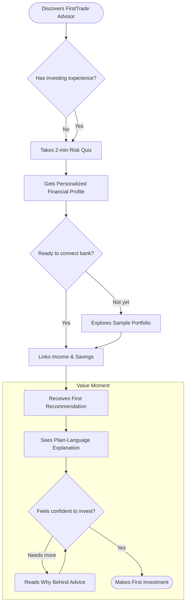

# User Flow Diagram

Generated from brief: *finace advisor for someone new to stock market in early,late 20s...*

```mermaid
flowchart TD
    A([Discovers FirstTrade Advisor]) --> B{Has investing experience?}
    B -- No --> C[Takes 2-min Risk Quiz]
    B -- Yes --> C
    C --> D[Gets Personalized Financial Profile]
    D --> E{Ready to connect bank?}
    E -- Not yet --> F[Explores Sample Portfolio]
    E -- Yes --> G[Links Income & Savings]
    F --> G
    G --> H[Receives First Recommendation]

    subgraph Value Moment
        H --> I[Sees Plain-Language Explanation]
        I --> J{Feels confident to invest?}
        J -- Needs more --> K[Reads Why Behind Advice]
        K --> J
        J -- Yes --> L([Makes First Investment])
    end
```
